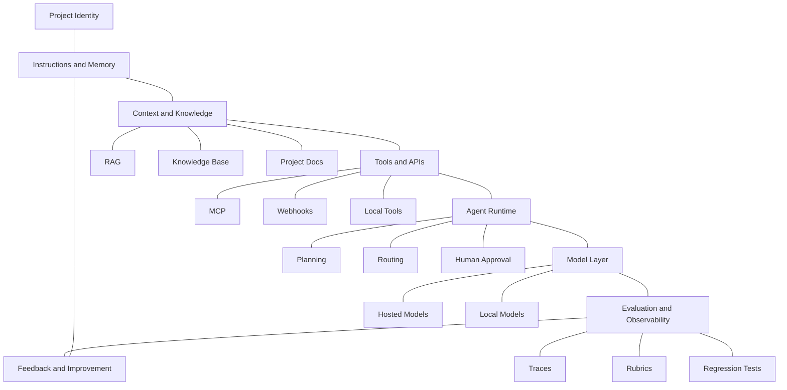

# Hi, I'm Sayed Allam 👋

**AI Engineer · LLM Agents Architect · AI Automation Developer · AI Evaluation Specialist**

I build AI systems around LLM agents, RAG, automation, local inference, tool use, evaluation, and self-improving workflows.

I like working close to how AI agents behave: how they understand tasks, use context, choose tools, fail, recover, and improve through feedback.

· [GitHub](https://github.com/oxbshw) · [X](https://x.com/Sayedevv) · [Bluesky](https://bsky.app/profile/sayedev.bsky.social)

---

## What I Focus On

- LLM agents that use tools, APIs, memory, retrieval, and structured workflows
- RAG systems for knowledge bases, internal assistants, and source-grounded answers
- AI automation with n8n, webhooks, APIs, schedules, and approval flows
- Agent identity files such as AGENTS.md, CLAUDE.md, GEMINI.md, llms.txt, and project memory
- Local AI agents using Ollama, LM Studio, llama.cpp, vLLM, SGLang, GGUF, and local APIs
- Evaluation workflows for prompts, agents, retrieval quality, tool calls, and model behavior
- Self-improving agent patterns using feedback, traces, rubrics, memory, and regression tests
- MCP-based tool integrations, coding agents, browser agents, and agentic workflows

---

## How I Think About AI Systems

I think about AI systems as a loop, not a one-shot prompt.

A strong AI system needs more than a model. It needs identity, instructions, context, tools, memory, evaluation, observability, and a way to improve after each run.

---

## What I Build

- LLM agent systems
- Local AI agents
- RAG-based assistants
- AI-ready knowledge systems
- Agent instruction files
- AI automation workflows
- Internal AI copilots
- Multi-agent research workflows
- Tool-calling agent infrastructure
- MCP-based tool integrations
- Evaluation and feedback pipelines
- Human-in-the-loop AI workflows
- AI prototypes connected to real tools and data

---

## Featured Projects

| Project | Description |
|---|---|
| **LLM Agents Ecosystem Handbook** | A practical reference for understanding, building, evaluating, and deploying LLM agents. |
| **Ultimate n8n AI Workflows** | AI automation workflows using n8n, LLMs, APIs, triggers, and business tools. |
| **Context Engineering** | Experiments around retrieval, memory, context packing, long-context workflows, and token flow. |
| **Deep Semantic Enhancer** | A prompt enhancement system for turning rough ideas into structured instructions. |
| **Full System Prompts** | Research and examples around system prompts, instruction hierarchy, and model behavior. |
| **Curated MCP Servers** | A curated collection of MCP resources for building tool-using AI agents. |

---

## Technical Focus

### Agent Systems

- Tool-calling agents
- Planner-executor workflows
- Router agents
- Research agents
- Retrieval agents
- Multi-agent coordination
- Agent memory and state
- Agent handoffs
- Human approval flows
- Guardrails and tool validation
- Agent tracing and debugging
- MCP-based tool integration
- Local agent runtime design

### Agent Identity and AI-Readable Docs

- AGENTS.md workflows
- CLAUDE.md project memory
- GEMINI.md instructions
- llms.txt documentation maps
- Cursor rules
- Windsurf rules
- Project memory files
- System prompt files
- Prompt contracts
- Repository-specific agent guidance

### Retrieval and Knowledge

- RAG pipelines
- Agentic RAG
- GraphRAG
- Hybrid search
- Query rewriting
- Query expansion
- Reranking
- Context packing
- Context compression
- Source-grounded answers
- Knowledge freshness
- Retrieval evaluation
- Structured knowledge graphs

### Evaluation and Improvement

- Prompt evaluation
- Agent evaluation
- Tool-call evaluation
- Trace-based evaluation
- Retrieval quality evaluation
- Rubric-based scoring
- Failure analysis
- Hallucination detection
- Regression testing
- Feedback loops
- Self-improving workflows
- Cost and latency monitoring

### Automation and Workflows

- n8n workflows
- Webhooks
- REST APIs
- Scheduled workflows
- Event-driven automation
- Support automation
- Research automation
- Content workflows
- Approval-based workflows
- Human-in-the-loop systems
- Monitoring and alerting workflows

---

## Tools and Technologies

### Languages and Backend

### LLM Agents and Frameworks

### Coding Agents and Agent Rules

### Retrieval and Data

### Automation and Workflows

### Models, Local Inference and Providers

I work with hosted APIs, local inference stacks, and model routing layers for agents that need privacy, speed, offline workflows, fallback routing, or full control over behavior.

**Local inference and agent runtime**

### Evaluation and Observability

---

## Open to Collaboration

I'm open to collaborating on:

- LLM agents and agentic workflows
- Local AI agents
- AI-ready knowledge systems
- AI training and model evaluation
- RAG and context engineering
- n8n AI automation
- MCP and tool-using agents
- AI observability and evaluation tools
- Voice agents and multimodal workflows
- Open-source AI infrastructure

---

## GitHub Stats

---

## Connect With Me

- Portfolio: [sayedev.framer.ai](https://sayedev.framer.ai)
- GitHub: [github.com/oxbshw](https://github.com/oxbshw)
- X: [@Sayedevv](https://x.com/Sayedevv)
- Bluesky: [sayedev.bsky.social](https://bsky.app/profile/sayedev.bsky.social)

---

**Building AI systems that connect language models with tools, knowledge, evaluation, automation, and real work.**

